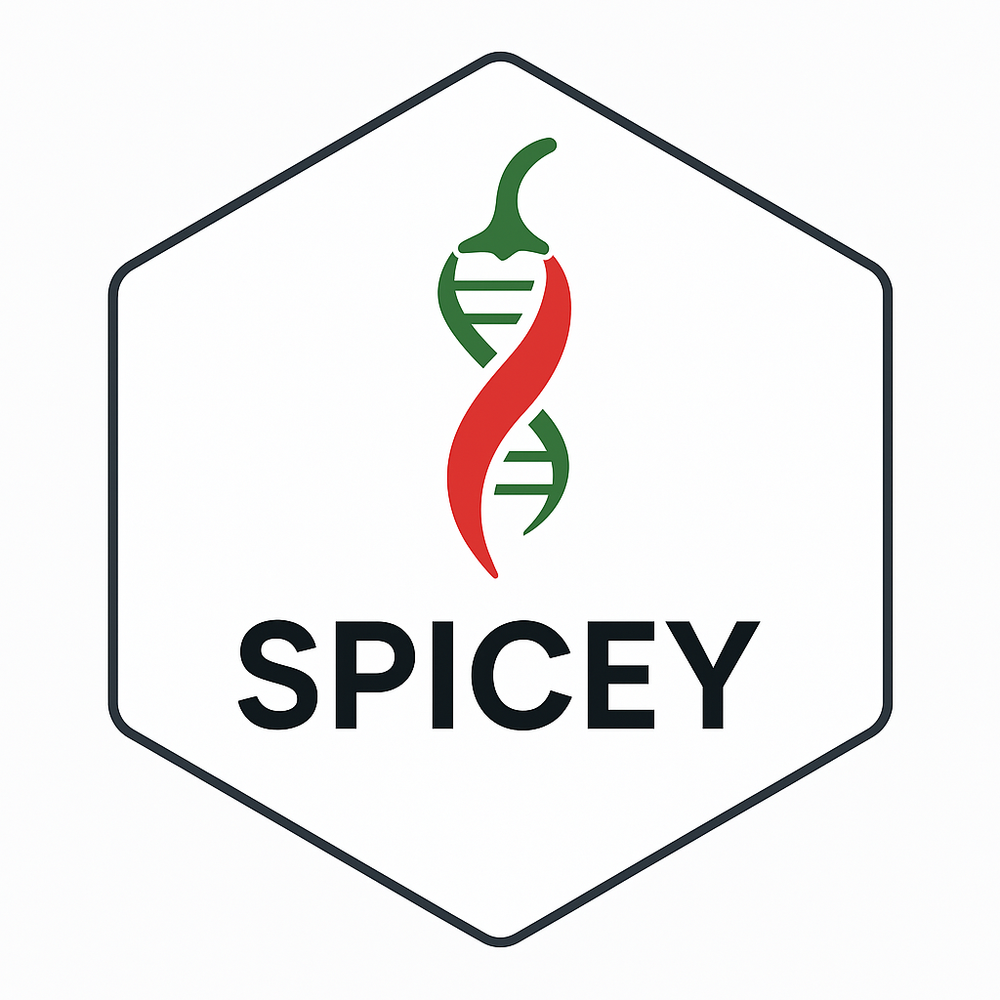

# SPICEY 

<!-- badges: start -->
<!-- badges: end -->

## Bioconductor release status

|      Branch      |    R CMD check   | Last updated |
|:----------------:|:----------------:|:------------:|
| [_devel_](http://bioconductor.org/packages/devel/bioc/html/SPICEY.html) | [](http://bioconductor.org/checkResults/devel/bioc-LATEST/SPICEY) |  |
| [_release_](http://bioconductor.org/packages/release/bioc/html/SPICEY.html) | [](http://bioconductor.org/checkResults/release/bioc-LATEST/SPICEY) |  |

The goal of SPICEY is to provide a user-friendly pipeline for quantifying and visualizing tissue specificity specificity

## Installation

You can install the latest release of `SPICEY` the github repository:

    devtools::install_github("georginafp/SPICEY")

Now you can load the package using `library(SPICEY)`.

## Basic usage

For detailed instructions on how to use SPICEY, please see the [vignette](/doc/SPICEY.html).

``` r
library(SPICEY)
```

``` r
## Nearest gene mode
result_nearest <- run_spicey(
  atac_path = system.file("extdata", "FINAL_ATAC.rds", package = "SPICEY"),
  rna_path = system.file("extdata", "FINAL_RNA.rds", package = "SPICEY"),
  linking_method = "nearest"
)

## Co-accessibility mode
result_coacc <- run_spicey(
  atac_path = system.file("extdata", "FINAL_ATAC.rds", package = "SPICEY"),
  rna_path = system.file("extdata", "FINAL_RNA.rds", package = "SPICEY"),
  links_path = system.file("extdata", "COACC_LINKS.rds", package = "SPICEY"),
  linking_method = "coaccessibility"
)

```

## Code of Conduct

Please note that the SPICEY project is released with a [Contributor
Code of
Conduct](https://contributor-covenant.org/version/2/0/CODE_OF_CONDUCT.html).
By contributing to this project, you agree to abide by its terms.
