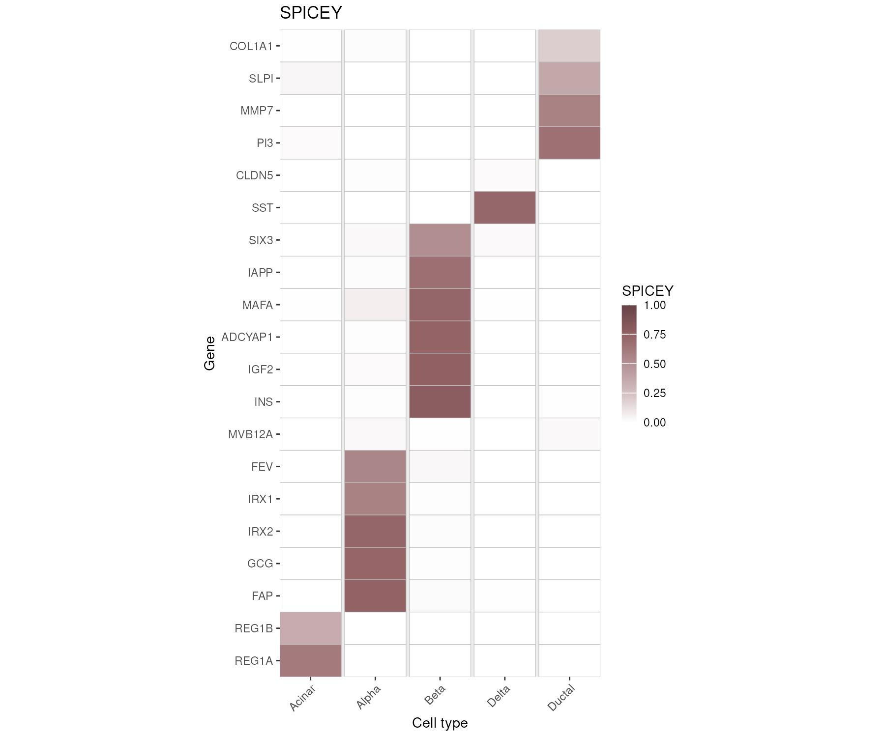

# SPICEY 

<!-- badges: start -->

<!-- badges: end -->

## Bioconductor release status

| Branch | R CMD check | Last updated |
|:------------------------:|:------------------------:|:-------------------:|
| [*devel*](http://bioconductor.org/packages/devel/bioc/html/SPICEY.html) | [](http://bioconductor.org/checkResults/devel/bioc-LATEST/SPICEY) |  |
| [*release*](http://bioconductor.org/packages/release/bioc/html/SPICEY.html) | [](http://bioconductor.org/checkResults/release/bioc-LATEST/SPICEY) |  |

The goal of SPICEY is to provide a user-friendly pipeline for quantifying and visualizing tissue specificity specificity

## Installation

Install the latest release of SPICEY from Bioconductor:

```{r install, eval=FALSE, echo=TRUE}
if (!requireNamespace("BiocManager", quietly = TRUE))
    install.packages("BiocManager")

BiocManager::install("SPICEY")
```

Now you can load the package using `library(SPICEY)`.

## Basic usage

For detailed instructions on how to use SPICEY, please see the vignette once the package is installed using: `vignette("SPICEY")`.

``` r
library(dplyr)
library(GenomicRanges)
library(TxDb.Hsapiens.UCSC.hg38.knownGene)
library(org.Hs.eg.db)
library(SPICEY)

# Annotate peaks to genes with coaccessibility
peaks <- unique(unlist(atac)[,c("region_id")])
annotation_coacc <- annotate_with_coaccessibility(
   peaks = peaks,
   txdb = TxDb.Hsapiens.UCSC.hg38.knownGene,
   links_df = cicero_links,
   annot_dbi = org.Hs.eg.db,
   protein_coding_only = TRUE,
   verbose = TRUE,
   add_tss_annotation = FALSE,
   upstream = 2000,
   downstream = 2000
)

# Calculate SPICEY measures and link them with coaccessibility
spicey_coacc <- SPICEY(
  rna = rna,
  atac = atac,
  annotation = annotation_coacc
)

# Plot results
spicey_heatmap(spicey_coacc$linked, 
               spicey_measure = "SPICEY",
               combined_zscore = TRUE)
```



## Code of Conduct

Please note that the SPICEY project is released with a [Contributor Code of Conduct](https://contributor-covenant.org/version/2/0/CODE_OF_CONDUCT.html). By contributing to this project, you agree to abide by its terms.
